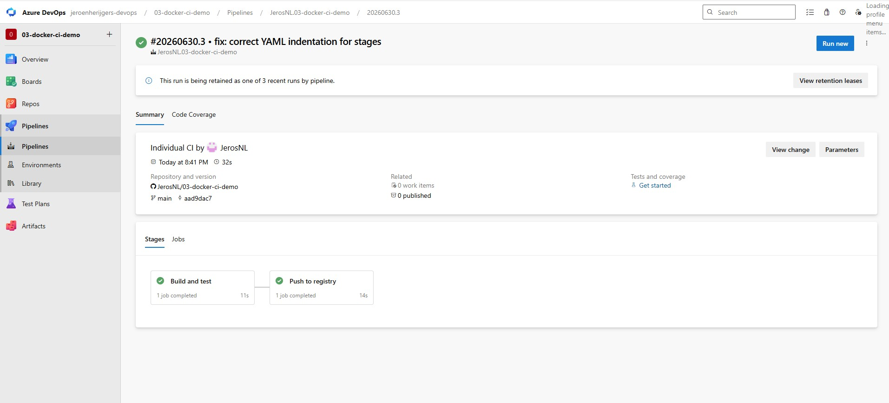
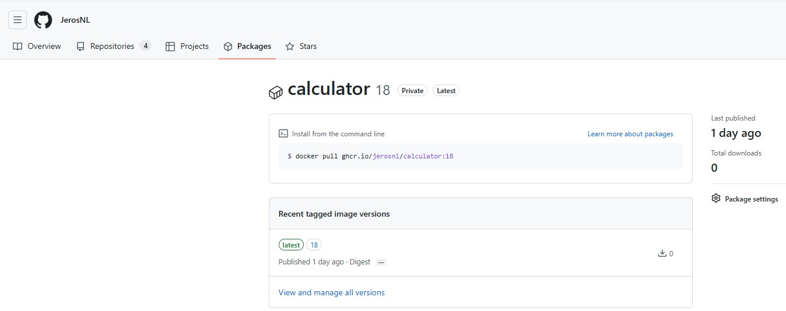

# Docker CI Demo

## What this is

A Python calculator app, containerised with Docker and built/pushed automatically through an Azure DevOps pipeline. This is my third hands-on DevOps project, building on Project 1 (CI) by adding containerisation.

## What the pipeline does

```
GitHub Push → Build Docker image (tests run inside the build) → Push to GitHub Container Registry
```

Tests run as part of the Docker build itself. If a test fails, the image cannot be built, which means it is impossible to push a broken image to the registry.

Every run produces two tags:
- A unique tag matching the Azure DevOps build ID
- `latest`, always pointing at the most recent successful build

## What I learned

- A Docker image bundles the application with everything it needs to run, so it behaves the same on any machine — this solves the "it works on my machine" problem
- Dockerfile instruction order matters because of layer caching — copying `requirements.txt` before the application code means `pip install` only reruns when dependencies actually change, not on every code change
- Running tests inside the Dockerfile build step guarantees a broken image can never be pushed
- Docker Desktop on Windows blocks access to its named pipe for service accounts like NetworkService by default — the self-hosted agent needed to be added to the local `docker-users` group before it could run `docker build`
- Docker registry image names must be entirely lowercase, even if the GitHub username used for login has uppercase letters
- A Personal Access Token pasted anywhere outside its intended storage location — even in a chat — should be treated as compromised and revoked immediately, regardless of who else could see it

## Tech used

- Docker
- Python, pytest
- GitHub Container Registry (ghcr.io)
- Azure DevOps Pipelines
- Self-hosted Windows agent

## Screenshots


